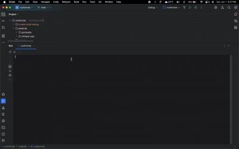

# VoxFormat: Voice-Powered Document Creation and Formatting




VoxFormat is a command-line interface (CLI) application designed to streamline the process of digitizing handwritten notes or drafting documents through voice dictation. It allows users to speak their text, which is transcribed in real-time, and simultaneously apply formatting like bold and italics using simple voice commands. This tool aims to be a faster alternative to manual typing or potentially error-prone handwriting OCR, providing a direct path from spoken words to a structured digital document.

The application continuously listens to voice input, transcribes the speech, and parses specific voice cues (e.g., "format start bold," "format stop italic") to apply basic Markdown formatting to the output. The resulting document can then be automatically saved as a plain text file.

## Features

*   **Real-time Transcription:** Converts spoken audio to text on the fly.
*   **Voice-Controlled Formatting:** Apply **bold** and *italics* using voice commands during dictation.
*   **Continuous Operation:** Listens indefinitely until explicitly stopped by a voice command or a period of silence.
*   **Automatic Saving:** Saves the transcribed (raw) text to an `output.txt` file in an `outputs/` directory upon application exit.
*   **Live Terminal Preview:** Displays the Markdown-formatted document in the terminal as it's being created.
*   **Cross-Platform (Core):** Built with C++ and standard libraries, with platform-specific audio handling via PortAudio.

## Technologies Used

*   **Core Language:** C++ (utilizing C++20 features)
*   **Speech-to-Text Engine:** [Whisper.cpp](https://github.com/ggerganov/whisper.cpp) (using the `ggml-small.en.bin` model for a balance of accuracy and performance)
*   **Audio Capture:** [PortAudio](http://www.portaudio.com/) (cross-platform audio I/O library)
*   **Audio Resampling:** [libsamplerate (Secret Rabbit Code)](http://www.mega-nerd.com/SRC/)
*   **Build System:** CMake
*   **Concurrency:** `std::thread`, `std::mutex`, `std::condition_variable`, `std::atomic` for multi-threaded audio capture and processing.
*   **File I/O:** `std::fstream` and `std::filesystem` (C++17) for saving documents and managing paths.
*   **String Processing:** Standard C++ string libraries, `std::regex` for artifact cleaning.

## Setup Instructions

1.  **Clone the Repository:**
    It is crucial to clone with `--recurse-submodules` to fetch the PortAudio dependency. If you have already cloned without it, navigate to the project directory and run `git submodule update --init --recursive`.
    ```bash
    git clone --recurse-submodules https://github.com/spriha27/voxformat.git
    cd voxformat
    ```

2.  **Run Setup Script:**
    This script will download the necessary Whisper model (`ggml-small.en.bin`) and attempt to build external dependencies. Ensure you have `bash` and standard build tools (`make`, C++ compiler) installed.
    ```bash
    bash setup.sh
    ```
    The script will place the model in `external/whisper.cpp/models/`.

3.  **Build VoxFormat:**
    *   **Using CMake directly:**
        ```bash
        mkdir build 
        cd build
        cmake .. 
        make -j$(nproc || sysctl -n hw.ncpu) # Adjust -j for your number of cores
        ```
    *   **Using CLion:**
        1.  Open the `voxformat` project directory in CLion.
        2.  CLion should automatically detect `CMakeLists.txt`.
        3.  **Important for macOS (Metal GPU Acceleration):**
            *   Ensure the `ggml-metal.metal` file (from `external/whisper.cpp/`) is copied into your CMake build directory (e.g., `cmake-build-debug/` or `build/`). The `setup.sh` script attempts to do this.
            *   In CLion, go to `Run > Edit Configurations...`. Select the `voxformat` target. Set the **"Working directory"** to your CMake build directory (e.g., `/path/to/voxformat/cmake-build-debug` or `/path/to/voxformat/build`). This helps `libwhisper` find the Metal shaders at runtime.
        4.  Build the project using CLion's build button (hammer icon).

4.  **Run:**
    *   **From CMake build directory (after `make`):**
        ```bash
        ./voxformat 
        ```
    *   **From CLion:** Run the `voxformat` configuration.

## How to Use

1.  Start the application. You will see a message "--- Listening... ---".
2.  Begin speaking your text.
3.  To apply formatting, use the following voice commands clearly:
    *   `format start bold` - Subsequent text will be bold.
    *   `format stop bold` - Stops bold formatting.
    *   `format start italics` - Subsequent text will be italicized.
    *   `format stop italics` - Stops italic formatting.
4.  The application will display a live Markdown preview in the terminal.
5.  To stop the application and save the document:
    *   Say: `format stop application`
    *   Alternatively, the application will automatically stop and save after 60 seconds of continuous silence (no detected speech).
6.  Upon exit, a plain text file named `output.txt` will be saved in an `outputs/` directory within your project's root.

## Development Timeline & Phases

*   **Phase 0: Project Setup & Foundation (Initial Setup)**
    *   Initialized Git repository and basic C++ project structure with CMake.
    *   Defined core data structures (`TextSegment`).
*   **Phase 1: Audio Input & STT Integration (Core Transcription)**
    *   Integrated PortAudio for microphone audio capture.
    *   Integrated Whisper.cpp library.
    *   Successfully transcribed raw audio to text using `ggml-small.en.bin` model.
    *   Implemented basic audio resampling using libsamplerate.
    *   Transitioned to a multi-threaded architecture:
        *   Dedicated thread for audio capture (`AudioCapturer`).
        *   Dedicated worker thread for audio processing and STT (`WhisperProcessor`).
        *   Used mutexes and condition variables for thread-safe data exchange.
    *   Enabled Metal GPU acceleration on macOS for faster Whisper processing.
*   **Phase 2: Real-time Output & Basic Command Parsing (User Interaction)**
    *   Implemented live preview of transcribed text in the terminal.
    *   Developed initial `DocumentFormatter` class.
    *   Created a basic command parser within `DocumentFormatter` to recognize "format start/stop bold/italic" and "format stop application".
    *   Managed formatting state (bold, italic active).
    *   Implemented `print_current_document_preview` to display Markdown.
    *   Refined string utility functions (`to_lower`, `trim`, artifact cleaning).
*   **Phase 3: Application Lifecycle & File Output (Usability)**
    *   Implemented continuous listening mode.
    *   Added a silence detector: application automatically stops and saves after 60 seconds of no detected speech activity.
    *   Ensured "format stop application" voice command correctly terminates the application.
    *   Implemented automatic saving of the transcribed document (raw text) to `outputs/output.txt` upon application exit (either by command or silence timeout).
*   **Phase 4: Cleanup & Documentation (Current)**
    *   Refined code structure and comments.
    *   Created `README.md` and `setup.sh`.

## Problems Faced & Solutions

*   **Initial STT Inaccuracy & Duplication:**
    *   Early versions using simple, fixed, non-overlapping audio chunks fed to Whisper resulted in poor transcription quality and significant repetition of text.
    *   **Solution:** Transitioned to a multi-threaded model where audio capture is decoupled from processing. Implemented a streaming-like approach for `WhisperProcessor` using `whisper_state` and `new_segment_callback` from Whisper.cpp, which significantly improved transcription continuity and reduced duplication by leveraging Whisper's internal context management. (Based on recent logs, it seems we reverted to a simpler `whisper_full` on independent chunks in the worker thread, which also gave good results once GPU was active and chunking was managed well).
*   **Metal GPU Acceleration Not Engaging:**
    *   Initially, `whisper_full` calls were very slow, indicating CPU-only processing despite `use_gpu = true`.
    *   **Solution:** Ensured `ggml-metal.metal` was in the executable's runtime working directory (e.g., `cmake-build-debug/`) and CLion's "Working directory" setting was correct. This allowed `libwhisper` to find and compile the Metal shaders.
*   **CMake Configuration and Linking:**
    *   Several iterations were needed to correctly configure CMake to build and link PortAudio, libsamplerate, and Whisper.cpp, especially when managing them as submodules or included sources.
    *   **Solution:** Careful management of `add_subdirectory`, `FetchContent`, and `target_link_libraries`. Using explicit binary directories for subdirectories helped avoid conflicts.
*   **Thread Synchronization and Shutdown:**
    *   Ensuring clean shutdown of threads (audio capture, whisper processing) and PortAudio required careful use of atomic flags, condition variables, and thread joining.
    *   **Solution:** Implemented a clear stop signal (`g_main_stop_threads`) checked by all threads, and robust shutdown sequences in `main()`.
*   **Command Word Recognition:**
    *   The initial command keyword "vox" was often misheard by the `base.en` model.
    *   **Solution:** Switched to the more common English word "format," which improved STT reliability for commands. Further accuracy improvements came with the `small.en` model.

## Future Scopes

*   **GUI Implementation:** Develop a simple desktop GUI (e.g., using Qt or ImGui) for a more user-friendly experience than the CLI.
*   **Advanced De-duplication/Segment Merging:** Implement timestamp-based segment merging for even smoother and more accurate concatenation of transcribed text from overlapping windows.
*   **More Formatting Options:** Add support for underline, headings, lists, etc., via new voice commands.
*   **Customizable Output Filename:** Allow users to specify the output filename via a voice command (e.g., "format save my_document"). (The parser had this briefly, could be re-enabled and made more robust).
*   **Real-time Editing:** Allow users to pause dictation and manually edit the transcribed text in a GUI.
*   **Model Selection:** Allow users to choose different Whisper models (tiny, small, medium) based on their hardware and accuracy needs.
*   **Improved Error Handling & User Feedback:** More comprehensive error messages and status updates.
*   **Configuration File:** For settings like silence timeout, default model, etc.
*   **Support for More Languages:** Whisper.cpp supports many languages; this could be exposed.

---